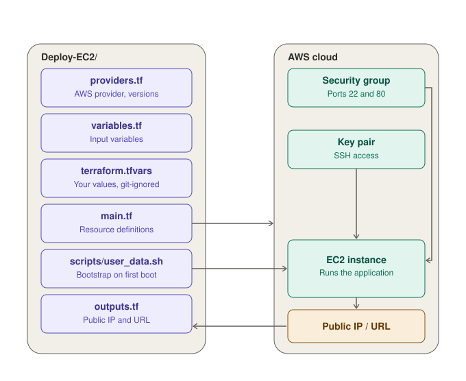

# 🚀 Deploy to AWS EC2 with Terraform

> Infrastructure as Code: provisioning an AWS EC2 instance and deploying an application with a single `terraform apply`.


[](https://github.com/dolev225/DevOps-Project/actions/workflows/ci.yml)

---

## 📖 Overview

This project uses **Terraform** to automatically create all the AWS resources needed to run an application on EC2: a key pair, a security group and the EC2 instance itself. A bootstrap script (`user_data`) installs the dependencies and starts the application on first boot, so the whole environment is reproducible with one command.

**What this project covers:**

- Defining infrastructure as code with Terraform
- Provisioning EC2, security groups and SSH key pairs
- Exposing outputs (public IP / URL) after deployment
- Clean teardown with `terraform destroy`

<!-- TODO: Add 1-2 sentences describing the specific application you deploy. -->

---

## 🏗️ Architecture

The Terraform files in this folder define the infrastructure. Running `terraform apply` creates the AWS resources, and the `user_data` script bootstraps the application on the instance's first boot.



| Component | Role |
|-----------|------|
| `main.tf` | Defines the security group, key pair and EC2 instance |
| `variables.tf` / `terraform.tfvars` | Configurable inputs and your own values |
| `scripts/user_data.sh` | Installs dependencies and starts the app on first boot |
| `outputs.tf` | Prints the instance public IP and application URL |

---

## 🧰 Tech Stack

| Category        | Tools                              |
|-----------------|------------------------------------|
| IaC             | Terraform                          |
| Cloud Provider  | AWS (EC2, VPC, Security Groups)    |
| OS              | Ubuntu / Amazon Linux              |
| Web Server      | <!-- Nginx / Apache / Node -->     |
| CI              | GitHub Actions                     |
| Version Control | Git & GitHub                       |

---

## ✅ Prerequisites

| Requirement | Notes |
|-------------|-------|
| [Terraform](https://developer.hashicorp.com/terraform/install) `>= 1.5` | Verify with `terraform -version` |
| [AWS CLI](https://aws.amazon.com/cli/) | Configured with `aws configure` |
| AWS account | IAM user/role with EC2 permissions |
| SSH key pair | Existing key in AWS, or generate one locally (see below) |

---

## 📁 Project Structure

```
└───Deploy-EC2
    ├───.terraform
    │   ├───modules
    │   └───providers
    │       └───registry.terraform.io
    │           └───hashicorp
    │               └───aws
    │                   └───6.66.0
    │                       └───windows_amd64
    └───Mode
        ├───instanc.tf
        ├───output.tf
        ├───screp.sh
        ├───sg.tf
        ├───var.tf
        └───VPC.tf
```

---

## ⚙️ Configuration

Variables are defined in `variables.tf`:

| Variable        | Description                          | Default       |
|-----------------|--------------------------------------|---------------|
| `aws_region`    | AWS region to deploy to              | `us-east-1`   |
| `instance_type` | EC2 instance type                    | `t2.micro`    |
| `key_name`      | Name of the SSH key pair             | n/a           |
| `allowed_ssh_cidr` | CIDR allowed to SSH (your IP/32)  | n/a           |

---

## 🚀 Deployment

### 1. Clone the repository

```bash
git clone https://github.com/dolev225/DevOps-Project.git
cd DevOps-Project/Cloude/DevOps-Project-01/Deploy-EC2
```

### 2. Authenticate with AWS

```bash
aws configure
# or export AWS_ACCESS_KEY_ID / AWS_SECRET_ACCESS_KEY / AWS_DEFAULT_REGION
```

### 3. Initialize Terraform

```bash
terraform init
```

### 4. Review the execution plan

```bash
terraform fmt -check
terraform validate
terraform plan
```

### 5. Apply

```bash
terraform apply
```

Type `yes` when prompted (or use `terraform apply -auto-approve` in automation). When it finishes, Terraform prints the outputs:

```
Outputs:

instance_public_ip = "x.x.x.x"
application_url    = "http://x.x.x.x"
```


### 6. Connect via SSH (optional)

```bash
chmod 400 my-key.pem
ssh -i my-key.pem ubuntu@<instance_public_ip>
```

---

## 🔄 CI Pipeline (GitHub Actions)

Every push and pull request to `main` that touches this project triggers the pipeline defined in
[`.github/workflows/ci.yml`](../../../.github/workflows/ci.yml).

| Job                     | Tool          | Purpose                                          |
|-------------------------|---------------|--------------------------------------------------|
| `terraform-validate`    | Terraform     | `fmt -check` and `validate` on the configuration |
| `lint-shell`            | ShellCheck    | Catch bugs in Bash scripts (incl. `user_data`)   |
| `lint-yaml`             | yamllint      | Validate YAML syntax and style                   |
| `lint-markdown`         | markdownlint  | Keep documentation clean                         |
| `secret-scan`           | Gitleaks      | Detect leaked credentials                        |
| `check-sensitive-files` | Git + Bash    | Fail if `.pem`, `.env` or `.tfstate` are committed |


---

## 🧹 Cleanup

To avoid unexpected AWS charges, destroy all resources when you are done:

```bash
terraform destroy
```

Confirm with `yes`. Terraform removes the instance, security group and key pair it created.

---

## 🛠️ Troubleshooting

| Problem | Possible Solution |
|---------|-------------------|
| `No valid credential sources found` | Run `aws configure` or export AWS credentials |
| `UnauthorizedOperation` | The IAM user lacks EC2 permissions |
| `InvalidKeyPair.NotFound` | Check `key_name` and that the key exists in the chosen region |
| Site not reachable after apply | Wait for `user_data` to finish; check the security group allows port 80 |
| `Permission denied (publickey)` | Check `chmod 400` on the key and the SSH username |
| State lock / drift issues | Run `terraform refresh` or inspect with `terraform state list` |

Useful: check the bootstrap log on the instance with `sudo cat /var/log/cloud-init-output.log`.

---

## 👤 Author

**Dolev**
GitHub: [@dolev225](https://github.com/dolev225)

---
