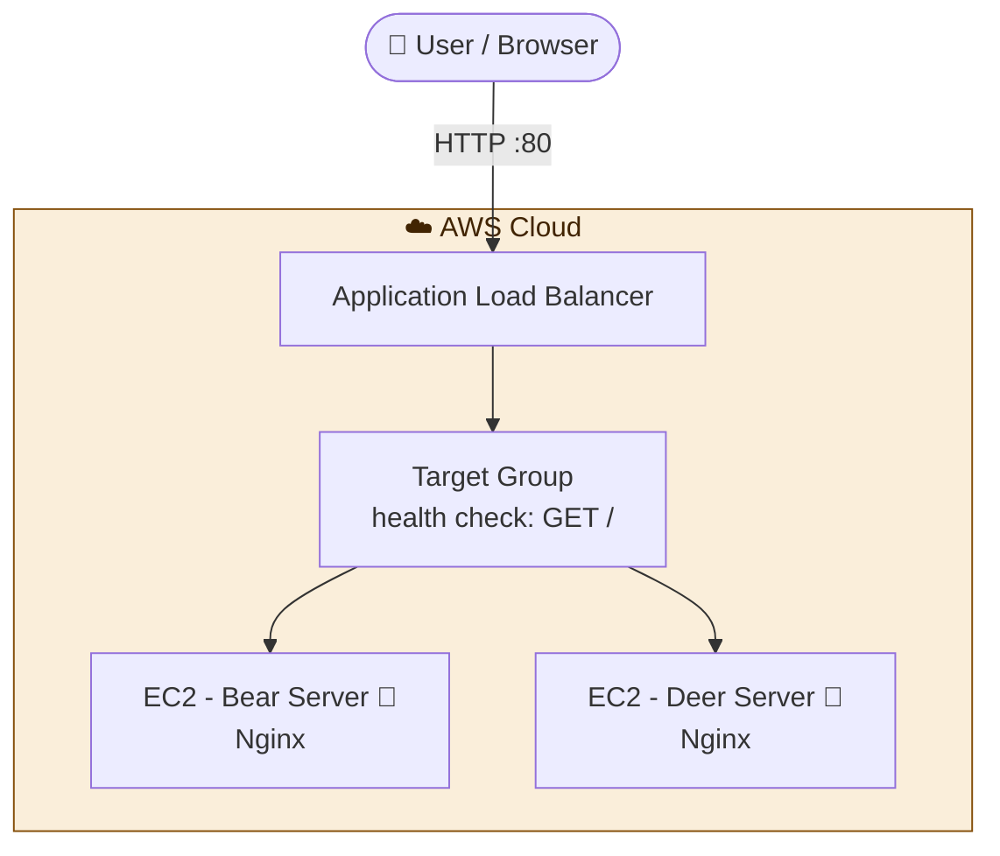

# ⚖️ Bear & Deer: AWS Load Balancer with Terraform

> Infrastructure as Code: an AWS Application Load Balancer distributing traffic between two EC2 servers, deployed with a single `terraform apply`.
> One server displays a **bear** 🐻 and the other a **deer** 🦌, so the load balancing is visible on every refresh.


---

## 📖 Overview

This project uses **Terraform** to create everything needed to run a load-balanced web application on AWS: an Application Load Balancer, a target group with health checks, security groups and two EC2 instances running **Nginx**. A bootstrap shell script (`scripts/html.sh`) runs on first boot, installs Nginx and publishes a page with the server's image.

Refreshing the load balancer URL alternates between the **Bear** server and the **Deer** server, which demonstrates how traffic is distributed.

**What this project covers:**

- Defining infrastructure as code with Terraform
- Provisioning a Load Balancer, target group, listener and health checks
- Launching two EC2 instances running Nginx
- Controlling access with security groups
- Automating server setup with a shell script (`html.sh`)
- Exposing the application URL as a Terraform output
- Clean teardown with `terraform destroy`

---

## 🏗️ Architecture



| Component | Role |
|-----------|------|
| **Application Load Balancer** | Public entry point, receives traffic on port 80 |
| **Target Group** | Registers both servers and monitors their health |
| **EC2 instance (Bear)** | Nginx server displaying the bear image |
| **EC2 instance (Deer)** | Nginx server displaying the deer image |
| **Security groups** | Control which traffic can reach the load balancer and the servers |

---

## 🧰 Tech Stack

| Category        | Tools                                        |
|-----------------|----------------------------------------------|
| IaC             | Terraform                                    |
| Cloud Provider  | AWS (ALB, EC2, VPC, Security Groups)         |
| OS              | Ubuntu                                       |
| Web Server      | Nginx                                        |
| Scripting       | Bash (`scripts/html.sh`)                     |
| Version Control | Git & GitHub                                 |

---

## ✅ Prerequisites

| Requirement | Notes |
|-------------|-------|
| [Terraform](https://developer.hashicorp.com/terraform/install) `>= 1.5` | Verify with `terraform -version` |
| [AWS CLI](https://aws.amazon.com/cli/) | Configured with `aws configure` |
| AWS account | IAM user/role with EC2 and ELB permissions |

---

## 📁 Project Structure

```
Dear&Bear
└───Load_blancer
    ├───.terraform
    │   ├───modules
    │   └───providers
    │       └───registry.terraform.io
    │           └───hashicorp
    │               └───aws
    │                   └───6.67.0
    │                       └───windows_amd64
    └───Mode
        └───scripts
```

---

## ⚙️ Configuration

Variables are defined in `variables.tf`:

| Variable        | Description                | Default     |
|-----------------|----------------------------|-------------|
| `aws_region`    | AWS region to deploy to    | `us-east-1` |
| `instance_type` | EC2 instance type          | `t2.micro`  |

<!-- TODO: Match this table to your real variables.tf (remove key_name if you don't use SSH). -->

---

## 🚀 Deployment

### 1. Clone the repository

```bash
git clone https://github.com/dolev225/DevOps-Project.git
cd "DevOps-Project/Cloude/DevOps-Project-02/Bear&Deer"
```

> The path contains `&`, so keep it in quotes in the terminal.

### 2. Authenticate with AWS

```bash
aws configure
# or export AWS_ACCESS_KEY_ID / AWS_SECRET_ACCESS_KEY / AWS_DEFAULT_REGION
```

### 3. Initialize Terraform

```bash
terraform init
```

### 4. Review the execution plan

```bash
terraform fmt -check
terraform validate
terraform plan
```

### 5. Apply

```bash
terraform apply
```

Type `yes` when prompted. When it finishes, Terraform prints the output:

```
Outputs:

URL = "http://<load-balancer-dns-name>"
```

### 6. Verify the load balancing

Wait 2-3 minutes for the servers to boot and pass health checks, then open the URL and **refresh several times**. The page alternates between the Bear and the Deer server.

You can also test from the terminal:

```bash
for i in $(seq 1 10); do curl -s http://<load-balancer-dns-name> | head -c 200; echo; done
```

### 7. Test high availability (optional)

Stop one of the instances in the EC2 console. After the health check fails, the load balancer sends all traffic to the remaining server. Start the instance again and it rejoins automatically.

---

## 📸 Screenshots

<!-- TODO: Add screenshots: the Bear page, the Deer page, the load balancer and target group in the AWS console. -->
<!--  -->
<!--  -->

---
## 🧹 Cleanup

The load balancer and instances cost money while running. Destroy everything when you are done:

```bash
terraform destroy
```

Confirm with `yes`. Terraform removes all the resources it created.

---

## 🛠️ Troubleshooting

| Problem | Possible Solution |
|---------|-------------------|
| `No valid credential sources found` | Run `aws configure` or export AWS credentials |
| `UnauthorizedOperation` | The IAM user lacks EC2 / ELB permissions |
| `503 Service Temporarily Unavailable` | Targets are not healthy yet. Wait a few minutes and check the target group in the console |
| Page always shows the same server | Browser keep-alive. Try an incognito window or `curl` in a loop |
| Image does not appear | Check the image source used in `scripts/html.sh` is reachable |
| State lock / drift issues | Run `terraform refresh` or inspect with `terraform state list` |

Useful: check the bootstrap log on an instance with `sudo cat /var/log/cloud-init-output.log`.


